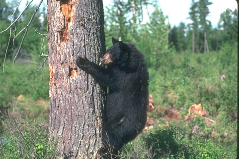
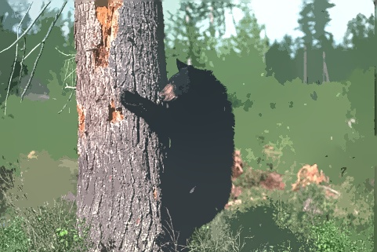
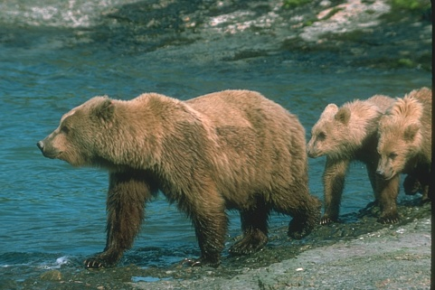

# Segmentación de imágenes de histopatología usando el algoritmo Mean-Shift. 
Comparación de varios criterios de parada.  

##Integrantes
-Alex Sanchez Saez
-Jose Carlos Pendas
-Ovidio Navarro Pazos
-Jesus Armando Padron 

## Introducción
En este trabajo se realiza la implementación de un código para el filtrado de imágenes utilizando el algoritmo Mean Shift. El enfoque se centra en el uso de un criterio de convergencia específico basado en un grupo abeliano definido por los autores del paper original. El código se compone de varias partes, cada una contribuyendo a la aplicación efectiva del algoritmo. para poner en marcha nuestro proyecto debe ejecutar utilizando el interprete de python el fichero `__main__.py__` que toma las imagenes almacenadas en la carpeta `input` y despues de procesarlas las coloca en la carpeta `output`. El criterio de parada nos fue proporcionado en [1].

## Código del Algoritmo Mean Shift
El código principal del algoritmo Mean Shift se encuentra en el archivo proporcionado. La función `mean_shift_custom_stopping` implementa el algoritmo Mean Shift con un criterio de parada personalizado. El usuario puede especificar la imagen de entrada, los radios espaciales y de color, así como un umbral de convergencia.

El criterio de convergencia se define en la función `custom_stopping_criterion`, que utiliza una función específica denominada `StpCrit`. Esta función compara dos desplazamientos consecutivos y decide si la convergencia se ha alcanzado. La lógica detrás de esta comparación está basada en un grupo abeliano, como se define en el archivo correspondiente.

## Código del Criterio de Convergencia
El archivo que contiene el código del criterio de convergencia define la función `StpCrit`, que compara dos matrices de desplazamiento y determina si la convergencia se ha alcanzado. La función utiliza una operación `H` definida en términos de otras operaciones auxiliares. La operación `H` es clave para el criterio de convergencia y se basa en la información de entropía y esperanza de las imágenes.

## Código del Grupo Abeliano
El grupo abeliano necesario para la definición de `H` se encuentra en el archivo correspondiente. Este código define operaciones como `Sum`, que representa la suma en un grupo abeliano, y `ImgDif`, que calcula la diferencia de dos imágenes. Estas operaciones son esenciales para la implementación del criterio de convergencia.

## Código de Operaciones Auxiliares
El archivo que contiene el código de las operaciones auxiliares define funciones como `E`, que calcula la entropía de Shannon de una imagen, y `Ep`, que calcula la esperanza de la imagen. Estas funciones son utilizadas en la operación `H` y contribuyen a la evaluación del criterio de convergencia.

## Conclusiones
El objetivo del proyecto era lograr una implementación eficiente de Mean-Shift para comparar 
los diferentes criterios de parada que aparecen en c[1] . Se logro ya que se logro un filtrado de imagenes , obteniendo resultados positivos y un rendimiento optimo por parte del algoritmo.

## Referencias Bibliográficas 
-Luis E. Fernández, Juliet Bringas, A. León-Mecías. New algebraic structure for the detection of 
similarity between images. An application to the Mean Shift Algorithm. Paper in preparation. 
-Damir Demirovi. An Implementation of the Mean Shift Algorithm. Published in Image Processing 
On Line on 2019–09–17. https://doi.org/10.5201/ipol.2019.255. 
Miguel A. Carreira-Perpiñán. A review of mean-shift algorithms for clustering. arXiv: 
1503.00687v1, 2015. similarity between images. An application to the Mean Shift Algorithm. Paper in preparation. 
Damir Demirovi. An Implementation of the Mean Shift Algorithm. Published in Image Processing 
On Line on 2019–09–17. https://doi.org/10.5201/ipol.2019.255. 
-Miguel A. Carreira-Perpiñán. A review of mean-shift algorithms for clustering. arXiv: 
1503.00687v1, 2015. 

#Algunos Resultados

| Input Image                          | Output Image                          |
| ------------------------------------ | ------------------------------------- |
|        | |
|        | |
|        | |

